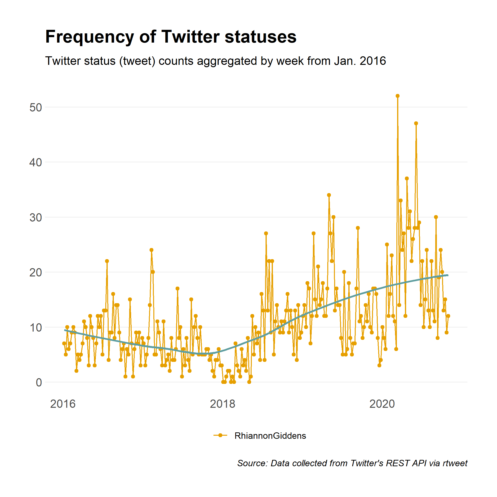
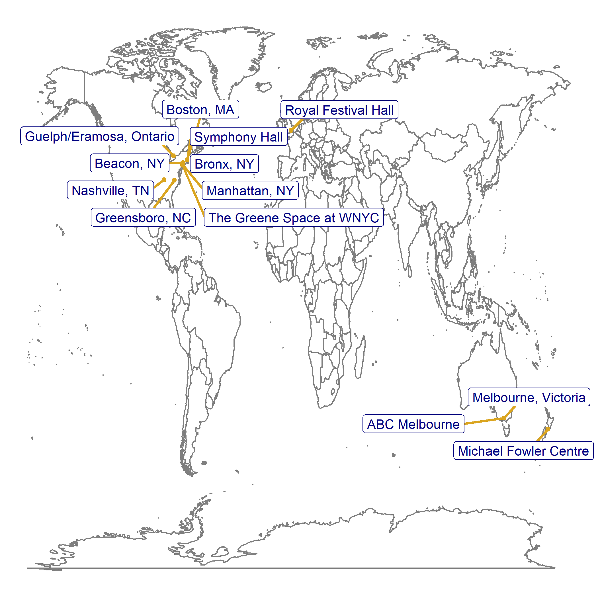

<!-- README.md is generated from README.Rmd. Please edit that file -->

```{r, include = FALSE}
knitr::opts_chunk$set(
  collapse = TRUE,
  comment = "#>"
)
```

## rtweet for twitter data

**Case study:  gather and analyze tweets**

<!-- badges: start -->
<!-- badges: end -->

Find this repository:  https://github.com/libjohn/workshop_twitter_analysis

Much of this review comes from [Introduction to gathering tweets with rwteet](https://docs.ropensci.org/rtweet/articles/intro.html) using the [`rtweet` package](https://docs.ropensci.org/rtweet/).  Conveniently, you **no longer need** a [Twitter API developer key](https://docs.ropensci.org/rtweet/articles/auth.html) to use this package.  You **do need a Twitter account.**  

Additionally, analysis techniques are derived from [_Tidy Text Modelling_](https://www.tidytextmining.com/)  by Sigle & Robinson





## Links used in the presentation

- https://github.com/libjohn/workshop_twitter_analysis
- https://docs.ropensci.org/rtweet
- https://rfun.library.duke.edu
- [Resources](blob/main/RESOURCES.Rmd)
- https://library.duke.edu/data
- https://github.com/libjohn/workshop_webscraping


license: "CC BY-NC"  
Creative Commong:  Attribution, Non-Commerical  
https://creativecommons.org/licenses/by-nc/4.0/  