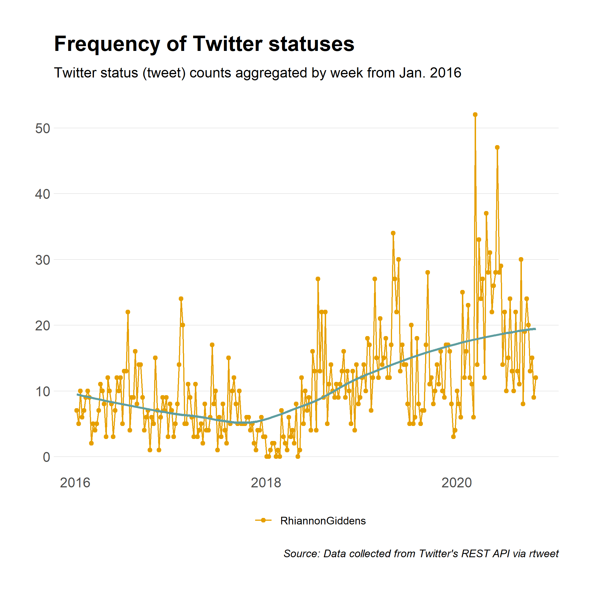

README
================
John Little
2021-06-17

<!-- README.md is generated from README.Rmd. Please edit that file -->
<!-- badges: start -->
<!-- all versions:  10.5281/zenodo.4908867 -->

[-blue "DOI")](https://doi.org/10.5281/zenodo.4908867)

<!-- badges: end -->

## rtweet for twitter data

**Case study: gather and analyze tweets**

Find this repository:
<https://github.com/libjohn/workshop_twitter_analysis>

Much of this review comes from [Introduction to gathering tweets with
rwteet](https://docs.ropensci.org/rtweet/articles/intro.html) using the
[`rtweet` package](https://docs.ropensci.org/rtweet/). Conveniently, you
**no longer need** a [Twitter API developer
key](https://docs.ropensci.org/rtweet/articles/auth.html) to use this
package. You **do need a Twitter account.**

Additionally, analysis techniques are derived from [*Tidy Text
Modelling*](https://www.tidytextmining.com/) by Sigle & Robinson

## Links used in the presentation

In addition to the links listed above, See Also:

-   <https://github.com/libjohn/workshop_twitter_analysis>
-   <https://docs.ropensci.org/rtweet>
-   [Twitter API access
    tokens](https://docs.ropensci.org/rtweet/articles/auth.html#access-tokensecret-method)
-   <https://rfun.library.duke.edu>
-   <https://library.duke.edu/data>
-   <https://github.com/libjohn/workshop_webscraping>
-   [Additonal Resources and third-party access options](RESOURCES.md)

license: “CC BY-NC”  
Creative Commong: Attribution, Non-Commerical  
<https://creativecommons.org/licenses/by-nc/4.0/>
