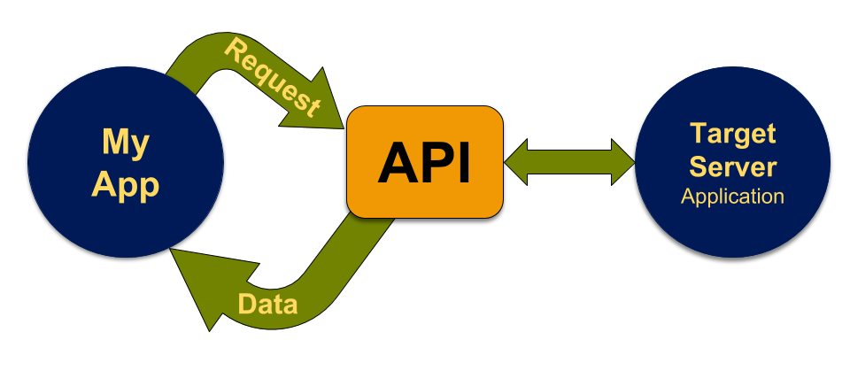

```{r setup, include=FALSE}
options(htmltools.dir.version = FALSE)
```

```{r xaringan-themer, include=FALSE, warning=FALSE}
library(tidyverse)
library(xaringanExtra)
xaringanExtra::use_tachyons()
library(htmltools)
tagList(rmarkdown::html_dependency_font_awesome())
# library(xaringanthemer)
#style_duo_accent(primary_color = "#012169", secondary_color = "#005587")
```

## Duke University: Land Acknowledgement

I would like to take a moment to honor the land in Durham, NC.  Duke University sits on the ancestral lands of the Shakori, Eno and Catawba people. This institution of higher education is built on land stolen from those peoples.  These tribes were here before the colonizers arrived.  Additionally this land has borne witness to over 400 years of the enslavement, torture, and systematic mistreatment of African people and their descendants.  Recognizing this history is an honest attempt to breakout beyond persistent patterns of colonization and to rewrite the erasure of Indigenous and Black peoples.  There is value in acknowledging the history of our occupied spaces and places.  I hope we can glimpse an understanding of these histories by recognizing the origins of collective journeys.


---
## Demonstration Goals

```{r child="_child-footer.Rmd", include=FALSE}
```

- Gather some tweets
- Define APIs and the Twitter Developer portal (Academic Use)
- Rudimentary text analysis and visualization
- Point out useful documentation / resources 


.f6.i.moon-gray[This is not a text analysis workshop.  The foundations of text analysis require considerably more time that we have. This is a demonstration on leveraging the following packages to gather twitter data: `tidyverse`, ropensci's `rtweet`, and  `tidytext`.  ]

--

### Background

- Building on earlier [Rfun workshops](https://rfun.library.duke.edu/)

---
## Application Program Interface 

```{r child="_child-footer.Rmd", include=FALSE}
```

A set of rules and protocols used to build a software application.  In the context of Web Scraping an API is a method used to gather clean data from a website. (data not wrapped in HTML, Javascript, etc.)

- Built for machine-to-machine interactions

- Instructions for programs



---
## Twitter Developer Portal

```{r child="_child-footer.Rmd", include=FALSE}
```

Publish & analyze Tweets, optimize ads, & create unique customer experiences with the Twitter API

- https://developer.twitter.com/en/apply-for-access

- https://developer.twitter.com/en/portal/petition/academic/is-it-right-for-you

- https://developer.twitter.com/en/portal/products

---
```{r child="_child-footer.Rmd", include=FALSE}
```

.pull-left[

## JSON

- [Javascript Object Notation](https://en.wikipedia.org/wiki/JSON) is a language-independent data format  
- Currently the most common data data format for asynchronous client/server communication format  
- Consists of key-value pairs  
- Elements of the data model (data structure) are embedded with the data, relative to the data record
- `jsonlite` package for parsing JSON
- `rwteet` (specific to the twitter developer API)

]  
.pull-right[
```{json example}
{
  "firstName": "John",
  "lastName": "Smith",
  "isAlive": true,
  "age": 25,
  "address": {
    "streetAddress": "21 2nd Street",
    "city": "New York",
    "state": "NY",
    "postalCode": "10021-3100"
  },
  "phoneNumbers": [
    {
      "type": "home",
      "number": "212 555-1234"
    },
    {
      "type": "office",
      "number": "646 555-4567"
    },
    {
      "type": "mobile",
      "number": "123 456-7890"
    }
  ],
  "children": [],
  "spouse": null
}
```
]

???

JSON record from https://en.wikipedia.org/wiki/JSON


---
## rtweet

```{r child="_child-footer.Rmd", include=FALSE}
```

R client for accessing Twitter’s REST and stream APIs from **ROpenSci**  

https://docs.ropensci.org/rtweet/

- Documentation
- [Obtaining and using access tokens](https://docs.ropensci.org/rtweet/articles/auth.html)
- [Intro to rtweet: Collecting Twitter Data](https://docs.ropensci.org/rtweet/articles/intro.html)

---
## Text analysis 

```{r child="_child-footer.Rmd", include=FALSE}
```

- [`tidytext` (package)](https://juliasilge.github.io/tidytext/): Text mining using tidy tools

- [Text Mining with R!](https://www.tidytextmining.com/) by Silge and Robinson

    - Case study: comparing Twitter archives
    
- [SCISS Text Analysis curriculum](https://sicss.io/curriculum)

---
## Code

```{r child="_child-footer.Rmd", include=FALSE}
```

https://github.com/libjohn/workshop_twitter_analysis

---
class:  middle, center

.bg-washed-blue.b--navy.ba.bw2.br3.shadow-5.ph4.mt5[

## John R Little

.f5.blue[Data Science Librarian  
Center for Data & Visualization Sciences  
Duke University Libraries  
]

.f7[https://johnlittle.info]  
.f7[https://Rfun.library.duke.edu]  
.f7[https://library.duke.edu/data]
]

<i class="fab fa-creative-commons fa-2x"></i> &nbsp; <i class="fab fa-creative-commons-by fa-2x"></i><i class="fab fa-creative-commons-nc fa-2x"></i>  
.f6.moon-gray[Creative Commons:  Attribution-NonCommercial 4.0]  
.f7.moon-gray[https://creativecommons.org/licenses/by-nc/4.0]


